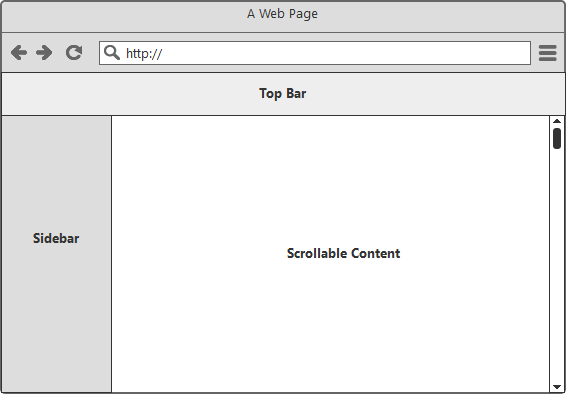
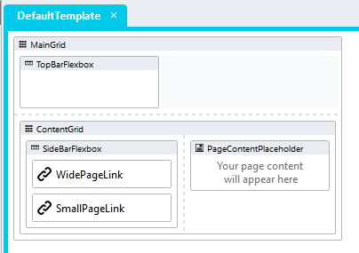

# Advanced Layouts: Holy Grail
An example of how to achieve the layout below in Stadium



## Holy what?
Back in the days before CSS had Flexbox and Grid displays, this layout was frequently requested, but very hard to create. It hence got the name Holy Grail Layout. 

## Version
1.0

## Application Setup
1. Check the *Enable Style Sheet* checkbox in the application properties

## DefaultTemplate Setup
1. Drag a *Grid* control to the DefaultTemplate and name it "MainGrid"
2. Add a class called "main-grid" to the "MainGrid" control *Classes* property 
4. Drag a *Flexbox* control into the "MainGrid" control and name it "TopBarFlexbox"
5. Add a class called "topbar-flex" to the "TopBarFlexbox" control *Classes* property 
6. Uncheck the *Inline* display property on the "TopBarFlexbox" control
7. Drag a *Grid* control into the "MainGrid" control, place it underneath the "TopBarFlexbox" control and name it "ContentGrid"
8. Add a class called "content-grid" to the "ContentGrid" control *Classes* property 
9. Drag a *Flexbox* control into the "ContentGrid" control and name it "SideBarFlexbox"
10. Add a class called "sidebar-flex" to the "SideBarFlexbox" control *Classes* property 
11. Set the *Direction* property of the "SideBarFlexbox" control to *Column*
12. Uncheck the *Inline* property of the "SideBarFlexbox" control
13. Drag the *PageContentPlaceholder* control into the "ContentGrid" control and place it to the right of the "SideBarFlexbox" control



## Customising the layout
The *holy-grail-layout-variables.css* file included in this repo contains a set of variables that can be changed to customise the holy-grail-layout popup. Follow the steps below to create a custom popup implementation 
1. Open the CSS file called [*holy-grail-layout-variables.css*](holy-grail-layout-variables.css) from this repo in an editor of your choice (I recommend [VS Code](https://code.visualstudio.com/))
2. Adjust the variables in the *:root* element as you see fit

## Applying the CSS
How to apply the CSS to your application
1. Create a folder called *CSS* inside of your Embedded Files in your application
2. Drag the two CSS files from this repo [*holy-grail-layout-variables.css*](holy-grail-layout-variables.css) and [*holy-grail-layout.css*](holy-grail-layout.css) into that folder

#### Stadium 6 (versions 6.6 and above)
2. Paste the link tags below into the *head* property of your application
```
<link rel="stylesheet" href="{EmbeddedFiles}/CSS/holy-grail-layout-variables.css">
<link rel="stylesheet" href="{EmbeddedFiles}/CSS/holy-grail-layout.css">
``` 

#### Stadium 5
2. Add a Javascript action into the Page.load event handler 
3. Paste the Javascript below into the Javascript action Code Editor popup
```
let URL = window.location.protocol + "//" + window.location.host + "/" + window.location.pathname + "//";
let el1 = document.createElement("link");
el1.setAttribute("rel","stylesheet");
el1.setAttribute("href",URL + "Content/EmbeddedFiles/CSS/holy-grail-layout.css");
document.querySelector("head").appendChild(el1);
let el2 = document.createElement("link");
el2.setAttribute("rel","stylesheet");
el2.setAttribute("href",URL + "Content/EmbeddedFiles/CSS/holy-grail-layout-variables.css");
document.querySelector("head").appendChild(el2);
``` 

## Upgrading
To upgrade this module
1. Pull the latest repo
2. If you have made changes to the *holy-grail-layout-variables.css* file in your local repo, merge the two files
3. You can drag the *holy-grail-layout.css* file into the EmbeddedFiles folder of your application as is
4. Select "Overwrite" when prompted in Stadium
5. Open the *holy-grail-layout-variables.css* file 
6. If new variables were added, change the variables as you see fit 
7. Drag the updated *holy-grail-layout-variables.css* file into the EmbeddedFiles folder of your application
8. Select "Overwrite" again when prompted in Stadium